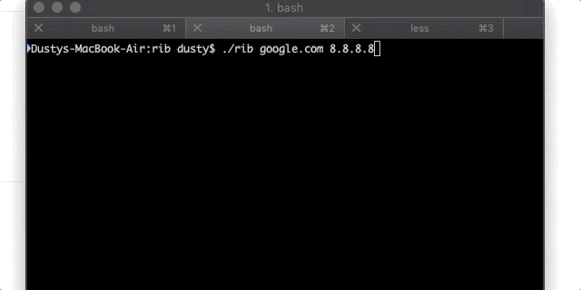

# rib is a DNS tool, for making requests and other DNS troubleshooting
It's garbage, don't use it. All it does right now is resolve A and PTR records.

Current syntax is ./rib IPorHostName NameServerAddress

## WHY ANOTHER DNS TOOL
I am making rib just for fun, to help me troubleshoot my [DNSgo](https://github.com/bsdpunk/DNSgo) server. Currrently it only makes PTR and A host requests, but it will be expanded to troubleshoot any server issues I have with DNSgo.

